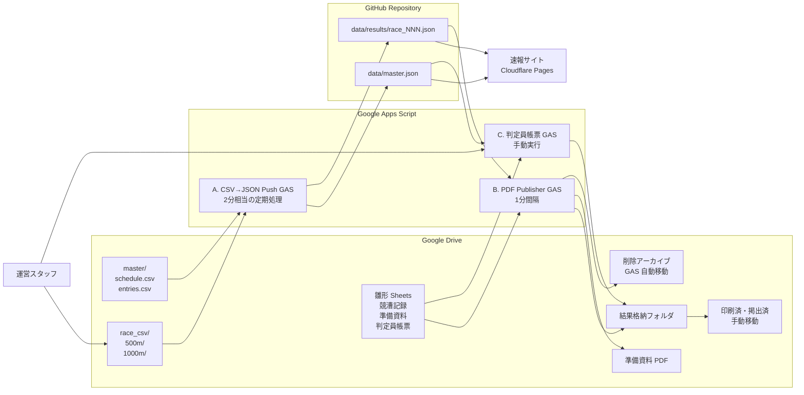

# マスターズレガッタ 2026 — システムアーキテクチャ

このドキュメントは、マスターズレガッタ 2026 の速報サイト、CSV 取り込み、PDF 自動生成、判定員帳票生成の全体像を整理し、将来の管理者ダッシュボード開発に再利用できるようにするための設計メモである。

## 関連文書

| ドキュメント | 内容 |
|---|---|
| `docs/SPEC_phase3_config.md` | Phase 3B インターフェース契約書（v1.1 凍結）。tournament.config.json / master.json v3 スキーマ正本 |
| `docs/REFACTORING_PLAN.md` | 完全リファクタリング〜公開プラグイン化 計画書 |
| `docs/progress/refactor-plugin-tracker.md` | リファクタリング進捗管理表（最新進捗はここ） |
| `docs/hub-site-spec.md` | 年間ハブサイト仕様 |
| `docs/SPEC.md` | ⚠️ 廃止（2026-06-12 本ドキュメントへ統合済み） |
| `docs/operation-handover.md` | ⚠️ 廃止（2026-06-12 本ドキュメントへ統合済み） |

## 1. 全体構造

### データフロー図



### 主要コンポーネント一覧

| コンポーネント | 場所 | 役割 |
|---|---|---|
| 速報サイト | `index.html`, `js/app.js`, `css/style.css` | Cloudflare Pages 上で公開される大会速報 UI。`master.json` と `race_NNN.json` を読み込み、レース情報・着順・区分を表示する。 |
| 大会マスタ | Drive `master/`, GitHub `data/master.json` | `schedule.csv`, `entries.csv` を元に生成される大会全体の基礎データ。 |
| 結果 JSON | GitHub `data/results/race_NNN.json` | 500m / 1000m CSV から生成されるレース別結果データ。速報サイトと PDF Publisher が参照する。 |
| CSV→JSON Push GAS | `gas/Code.gs` | Drive 上の CSV を解析し、GitHub の JSON データを更新する既存 GAS。 |
| PDF Publisher GAS | `gas/pdf_publisher/Code.gs`, `gas/pdf_publisher/Setup.gs` | GitHub の結果 JSON を監視し、競漕記録 PDF と準備資料 PDF を生成する新規 GAS。 |
| 判定員帳票 GAS | `gas/judge_form_publisher/Code.gs`, `gas/judge_form_publisher/Setup.gs` | 判定員用帳票 PDF を手動生成する新規 GAS。 |
| 雛形 Sheets | Drive 上の Template | PDF Publisher と判定員帳票 GAS がコピーして使う帳票テンプレート。 |
| Drive 出力フォルダ | 結果格納・印刷済・削除アーカイブ等 | PDF 成果物の保存、手動運用、削除退避に使う。 |

## 2. データソース・データフロー

### 入力データ

- Drive `master/` フォルダ
  - `schedule.csv`: レース番号、日時、距離、カテゴリ等のスケジュール情報。
  - `entries.csv`: 出漕クルー、団体名、クルー名、レーン、カテゴリ等のエントリー情報。
- Drive `race_csv/500m/`, `race_csv/1000m/`
  - 計測結果 CSV。CSV→JSON Push GAS が未処理 CSV を検知して取り込む。
- Drive 上の Template
  - 競漕記録テンプレ、準備資料テンプレ、判定員帳票テンプレ。

### 中間データ

- GitHub `data/master.json`
  - 速報サイト、PDF Publisher、判定員帳票生成で共通参照する大会マスタ。
- GitHub `data/results/race_NNN.json`
  - レースごとの計測結果。速報サイト表示と PDF 自動生成のトリガーになる。

### 出力

- 速報サイト
  - Cloudflare Pages で公開。GitHub の `data/` を読み込む。
- Drive 結果フォルダ
  - 競漕記録 PDF、判定員帳票 PDF を格納する。
- 印刷済・掲出済アーカイブ
  - 掲出後の PDF を運営が手動移動する。
- 削除アーカイブ
  - PDF Publisher GAS が削除・再生成時の退避先として自動移動する。
- 準備資料 PDF
  - 結果なしの事前配布・運営確認用資料。

## 3. GAS プロジェクト一覧（3つ）

### A. CSV→JSON Push GAS（既存）

- 場所: `gas/Code.gs`（リポジトリ内）
- 役割: Drive `race_csv/` の CSV を解析し、`race_NNN.json` を生成して GitHub に Push する。
- トリガー: 2分間隔相当。ただし GAS の `everyMinutes()` は 1 / 5 / 10 / 15 / 30 のみ対応のため、実装・運用上は制約に注意する。
- 主要関数:
  - `runImportMaster`
  - `processPendingCSVs`
  - `clearAllResults`
  - `onTrigger`
- スクリプトプロパティ:
  - `GITHUB_TOKEN`
  - `GITHUB_REPO`
  - `DRIVE_FOLDER_ID_500M`
  - `DRIVE_FOLDER_ID_1000M`
  - `DRIVE_FOLDER_ID_MASTER`
  - `MEASUREMENT_POINTS`

### B. PDF Publisher GAS（新規）

- 場所: `gas/pdf_publisher/Code.gs`, `gas/pdf_publisher/Setup.gs`
- 役割: GitHub の `race_NNN.json` を監視し、競漕記録 PDF を自動生成して Drive 結果フォルダに格納する。
- トリガー: 1分間隔。
- 主要関数:
  - `processPendingPDFs`
  - `generatePdf`
  - `generatePreRaceBookletForDate`
  - `initializeTemplate`
- バージョン: v0.15.3 時点（中点区切り対応）。
- スクリプトプロパティ:
  - `GITHUB_TOKEN`
  - `GITHUB_REPO`
  - `TEMPLATE_SHEET_ID`
  - `PDF_OUTPUT_FOLDER_ID`
  - `PDF_ARCHIVE_FOLDER_ID`

### C. 判定員帳票 GAS（新規）

- 場所: `gas/judge_form_publisher/Code.gs`, `gas/judge_form_publisher/Setup.gs`
- 役割: 判定員用帳票 PDF を手動生成する。A4横、モノクロ、レーン 1〜6 の横並び方式。
- トリガー: なし。手動実行のみ。
- 主要関数:
  - `generateAllJudgeForms`
  - `generateJudgeFormForDate`
  - `testGenerateRace1And2`
- バージョン: v0.5.3 時点。

## 4. 雛形 Sheets 構造

### A. 競漕記録テンプレ（gid=102040746）

- PDF Publisher が結果記入版 PDF の生成に使う。
- 主な列:
  - 順位
  - クルー名（2段: 団体名 + クルー名）
  - レーン
  - カテゴリ
  - 500m
  - 1000m
  - 備考
- `race_NNN.json` の結果値を流し込み、競漕記録として PDF 化する。

### B. 準備資料テンプレ（gid=1774552995）

- `generatePreRaceBookletForDate` が結果なし版 PDF の生成に使う。
- レーン 1〜6 固定。
- 着順は手書き対応。
- 大会前・当日朝の確認資料として、日付単位で分割生成する。

### C. 判定員帳票テンプレ（別 Spreadsheet）

- 判定員帳票 GAS が使う。
- A4横モノクロ。
- レーン 1〜6 を列方向に展開する横並び方式。
- レースごとに判定員が記入しやすい形で PDF 化する。

## 5. Drive フォルダ ID 一覧

| 用途 | フォルダ ID |
|---|---|
| master/（`schedule.csv`, `entries.csv` 置場） | スクリプトプロパティ `DRIVE_FOLDER_ID_MASTER` で管理 |
| race_csv/500m/ | スクリプトプロパティ `DRIVE_FOLDER_ID_500M` で管理 |
| race_csv/1000m/ | スクリプトプロパティ `DRIVE_FOLDER_ID_1000M` で管理 |
| 結果格納 | `1n74sgVFD40JIjDf06pltjKp77yBhs4mY` |
| 印刷済・掲出済（手動移動） | `1n-qDmHaNDXFi1BQ1mKMMT42-k6x22DGC` |
| 削除アーカイブ（GAS 自動移動） | `12a23a8CwR8f6yLMS_kt5C_M1ZnK1Xvp5` |
| 雛形 Sheets 置場 | `14rtLLIGSVg-E1z66nNwatuhvUYIVT-1z` |
| 準備資料 PDF | `1LHAVHRnwVgMaQL4ipaDGa6HINz-9oXkn` |
| 研修テスト | `1VKD6PA4XwqmaZQ0c4KNGO4vFI-OYVbrq` |

## 6. 主要なハマりポイントと対処

1. **GitHub API レート制限**
   - `Authorization` ヘッダー必須。未認証アクセスではレート制限が厳しく、GAS 定期実行で失敗しやすい。

2. **GAS UrlFetchApp 日次クォータ（20,000/日）**
   - `sha` 比較で fetch を削減する。
   - 必要以上に短いトリガー間隔を避ける。
   - PDF Publisher 側は既生成・未変更レースをスキップする。

3. **CacheService 値サイズ 100KB 制限**
   - 大きい JSON をキャッシュすると失敗する。
   - `try-catch` で CacheService 失敗時も処理継続できるようにする。

4. **GAS 実行時間 6 分制限**
   - 全日程・全レースを一括生成しない。
   - `generatePreRaceBookletForDate` のように日付ごとに分割実行する。

5. **Range.copyTo クロス Spreadsheet 禁止**
   - 異なる Spreadsheet 間では `Range.copyTo` が使えない。
   - 雛形 Spreadsheet を `makeCopy` してから `Sheet.copyTo` する。

6. **雛形セル結合**
   - 結合セルがある状態で範囲書き込みすると失敗・崩れが起きる。
   - 書き込み前に `breakApart()` で解除する。

7. **`runImportMaster` が `last_cleared_at` を消す**
   - `clearAllResults` を続けて実行する運用にする。
   - マスタ再取り込み後の結果クリア状態を確認する。

8. **`everyMinutes()` は 1/5/10/15/30 のみ**
   - GAS 標準トリガーでは 2分間隔を直接指定できない。
   - 2分間隔が必要な場合は代替実装または運用設計で吸収する。

9. **`Sheet#getRange` の `setValue` を 1セルずつ呼ぶと遅い**
   - 帳票生成では `setValues` で一括書き込みする。
   - 書式設定も可能な限り範囲単位にまとめる。

10. **`master.json` の `entries` に `category` が無い問題**
    - `entries.csv` に `category` 列を追加する。
    - 速報サイト、PDF Publisher、判定員帳票の表示項目とマスタ仕様を揃える。

## 7. 将来の管理者ダッシュボード構想

### 機能要件

1. 大会作成フォーム
   - 大会名（`race_name`）
   - 開催日（`dates`）
   - 会場（`venue`）
   - コース距離選択（500m / 1000m / 2000m）
   - 計測ポイント設定（`measurement_points`）

2. 自動セットアップ
   - GitHub リポジトリ作成、または既存リポジトリへのブランチ追加。
   - Google Drive 大会用フォルダ自動生成（`master/`, `race_csv/`, `results/`）。
   - 雛形 Sheets コピー。
   - GAS プロジェクト 3本を新大会用に複製。
   - スクリプトプロパティを自動投入。

3. 大会一覧表示
   - 過去開催大会の管理（年・大会名・状態）。
   - 各大会への切替。
   - `GITHUB_REPO`, `DRIVE_FOLDER_ID_*`, Template ID, 出力フォルダ ID を大会単位で切り替える。

4. アクセス管理
   - 管理者、運営スタッフ、閲覧者の権限を分離する。
   - 管理者は大会作成・設定変更・GAS セットアップが可能。
   - 運営スタッフは CSV アップロード、PDF 生成、帳票出力が可能。
   - 閲覧者は速報サイトと公開 PDF の参照のみ可能。

### 技術的検討

- フロントエンド:
  - 既存サイト（Cloudflare Pages + Vanilla JS）の管理画面拡張。
  - または、管理者向けに別ホスティングで独立 UI を用意する。
- バックエンド:
  - Google Apps Script の Web App API。
  - または Cloudflare Workers。
- 大会管理データ:
  - 複数大会を一覧化する `master_index.json` を別途管理する。
  - 大会 ID、GitHub repo、Drive folder IDs、Template IDs、公開 URL、状態を持たせる。
- 認証:
  - Google OAuth（Workspace 管理）を基本候補とする。
  - Drive / Sheets / GAS 操作の権限管理と整合しやすい。

### 開発ステップ案

1. `master_index.json` 仕様策定（複数大会対応）。
2. 大会作成 GAS を実装（Drive フォルダ・Sheets 自動生成）。
3. 管理画面 HTML を実装（form + プレビュー）。
4. GAS Web App をデプロイ。
5. 既存 3 GAS を「大会 ID パラメータ化」して再利用できるようにする。

### 管理者ダッシュボードで保持したい大会設定例

```json
{
  "race_id": "masters-regatta-2026",
  "race_name": "マスターズレガッタ 2026",
  "dates": ["2026/05/23", "2026/05/24"],
  "venue": "大会会場",
  "distances": [500, 1000],
  "measurement_points": ["500m", "1000m"],
  "github_repo": "owner/masters-regatta-2026",
  "drive": {
    "master_folder_id": "DRIVE_FOLDER_ID_MASTER",
    "race_csv_500m_folder_id": "DRIVE_FOLDER_ID_500M",
    "race_csv_1000m_folder_id": "DRIVE_FOLDER_ID_1000M",
    "pdf_output_folder_id": "1n74sgVFD40JIjDf06pltjKp77yBhs4mY",
    "pdf_archive_folder_id": "12a23a8CwR8f6yLMS_kt5C_M1ZnK1Xvp5"
  },
  "templates": {
    "race_record_sheet_id": "TEMPLATE_SHEET_ID",
    "judge_form_sheet_id": "JUDGE_TEMPLATE_SHEET_ID"
  },
  "status": "active"
}
```

## 8. 開発タイムライン（2026/05/13〜05/23）

| 日付 | マイルストーン |
|---|---|
| 2026/05/13 | 既存サイトの改善検討開始。 |
| 2026/05/19 | PDF Publisher GAS 初版。 |
| 2026/05/20 | 雛形 Sheets 構造確定、v0.6.0 安定運用。 |
| 2026/05/21 | カテゴリ対応、判定員帳票 GAS 新設、API クォータ対策。 |
| 2026/05/22 | 雛形構造変更対応、中点区切り表記。 |
| 2026/05/23 | 試合スケジュール ver5 反映、本番運用開始。 |

## 9. 主要ファイル

| パス | 役割 |
|---|---|
| `index.html` | 速報サイトの HTML エントリポイント。 |
| `js/app.js` | 速報サイトのロジック。区分列、着順表示、JSON 読み込みを担当。 |
| `css/style.css` | 速報サイトのスタイル。 |
| `data/master.json` | 大会マスタデータ。 |
| `data/results/race_NNN.json` | レース別結果データ。 |
| `gas/Code.gs` | CSV→JSON Push GAS。 |
| `gas/pdf_publisher/` | PDF Publisher GAS。競漕記録 PDF と準備資料 PDF を生成する。 |
| `gas/judge_form_publisher/` | 判定員帳票 GAS。 |
| `print_templates/` | ローカル雛形・PDF サンプル。 |
| `tools/` | PDF→CSV 変換スクリプト等の補助ツール。 |
| `docs/` | プロジェクトドキュメント。 |
| `template/` | 新大会立ち上げ用テンプレート（master/ は凍結のため書かない）。 |

---

## 10. CSV・データ仕様（SPEC.md 統合）

### CSVファイル命名規則（レース結果）

正規表現: `/^(?:\d{8}_\d{6}_)?R(\d{3})_(.+)\.csv$/i`

| 形式 | 例 | 備考 |
|---|---|---|
| 推奨 | `R001_500m.csv` | レース番号3桁ゼロ埋め必須 |
| 旧形式（互換） | `20260607_070000_R001_500m.csv` | RowingTimerWebが自動付与する日時プレフィクス |

よくあるミス（GASがスキップする）:

| NG例 | 問題点 |
|---|---|
| `R001_500.csv` | `m` が抜けている |
| `r001_500m.csv` | 先頭が小文字 |
| `R01_500m.csv` | レース番号が2桁（3桁必須） |

### schedule.csv カラム

| カラム | 例 | 説明 |
|---|---|---|
| race_no | 1 | レース番号（1から連番） |
| event_code | M1X | 種別コード（半角英数）。全角は自動正規化 |
| event_name | 男子シングルスカル | 種目名 |
| category | M / W / Mix | 性別区分 |
| age_group | G / DEF / JKLMN | 年齢カテゴリー。複数カテゴリー合同レースは連続記入（例: `DEF`） |
| round | FA | ラウンド（FA=決勝A等） |
| date | 2026/5/23 | 開催日（YYYY/M/DD） |
| time | 07:00 | 発艇時刻（HH:MM） |
| course_length | （空欄=1000m） | 500m種目は `500` と記入 |

### entries.csv カラム

| カラム | 例 | 説明 |
|---|---|---|
| race_no | 1 | レース番号 |
| lane | 1 | レーン番号（1〜6程度） |
| crew_name | 田中 太郎 | 選手名またはクルー名 |
| affiliation | 東京ローイングクラブ | 所属団体名 |
| category | D | 年齢カテゴリーコード（A〜N）。複数カテゴリー合同レースは必須 |

### フロントエンド仕様

UI は3ビュー構成（種目別・全レース一覧・スケジュール）。外部ライブラリ・ビルドツール一切不使用（Vanilla JS）。

| 処理 | 実装 |
|---|---|
| 初期ロード | `master.json` fetch → 全レース結果を並列fetch |
| 自動更新 | 120秒間隔。±15秒のランダムジッター付き |
| キャッシュ回避 | fetch URLに `?t=タイムスタンプ` を付加 |

---

## 11. インフラ・セキュリティ（SPEC.md 統合）

### HTTPヘッダー（_headers）

| 対象 | Cache-Control | 目的 |
|---|---|---|
| デフォルト（HTML等） | `no-cache` | 毎回再検証 |
| `data/*`（JSON） | `no-store, no-cache, must-revalidate` | 速報性確保 |
| `css/*, js/*` | `public, max-age=86400` | 1日キャッシュ |

### シークレット管理

| 項目 | 保管場所 |
|---|---|
| GitHub Token | GASスクリプトプロパティ（暗号化保存） |
| DriveフォルダID | GASスクリプトプロパティ |

### 禁止事項

- GitHub Token を GitHub に push しない
- master.json を直接手で編集しない（Python スクリプト使用）
- data/results/ フォルダを手で削除しない
- GAS スクリプトを無断で変更しない

---

## 12. 当日オペレーション（operation-handover.md 統合）

### 朝の準備（大会開始1時間前）

- [ ] 本番サイト https://masters-regatta-2026-3ha.pages.dev にアクセス確認
- [ ] スケジュールが全レース表示されているか確認
- [ ] Google Drive フォルダへのアクセス確認
- [ ] race_csv/500m/, race_csv/1000m/ フォルダが存在するか確認
- [ ] GAS トリガーが有効か確認

### レース中の運用

1. 計測担当者が `race_csv/500m/` に CSV ファイルをアップロード
2. 計測担当者が `race_csv/1000m/` に CSV ファイルをアップロード
3. 2分待機 → GAS が自動処理（CSV → JSON → GitHub Push）
4. 約1分後 → 本番サイトに結果が反映される（合計約3分）

### トラブルシューティング

| 症状 | 原因候補 | 対処 |
|---|---|---|
| 4分以上更新されない | GASトリガー停止 / CSVのフォルダ誤り / ファイル名不正 | 管理画面で監視確認 → GASで `runNow()` 手動実行 |
| GAS実行時間が枯渇 | 実行回数が多すぎた（想定外） | 翌日自動リセット。`runNow()` で補完 |
| 誤CSVをアップした | スタッフミス | 正しいCSVで上書きアップ。GASが最新ファイルを自動採用 |
| GitHub Token 切れ | Token有効期限超過 | Token を再生成 → GASスクリプトプロパティを更新 |
| サイト真っ白（全員） | Cloudflare Pages ダウン | Cloudflare Status ページ確認 |
| スケジュール未表示 | master.json が欠損 | GitHub で master.json を確認 |

### 既知の制約・リスク

| 制約 | 対策 |
|---|---|
| GAS実行時間 90分/日（無料枠）。実績は32〜40分/日 | 前日ON・最終日後OFFの運用。管理画面で残量表示 |
| GitHub API 5,000回/時 | 1レース1〜2 Push のため問題なし。制限検知時は15分自動スキップ |
| 反映遅延 最大3〜4分 | 速報用途として許容範囲。マニュアルに明記 |
| GAS `everyMinutes()` は 1/5/10/15/30 のみ | 2分間隔は代替実装または運用設計で吸収 |


